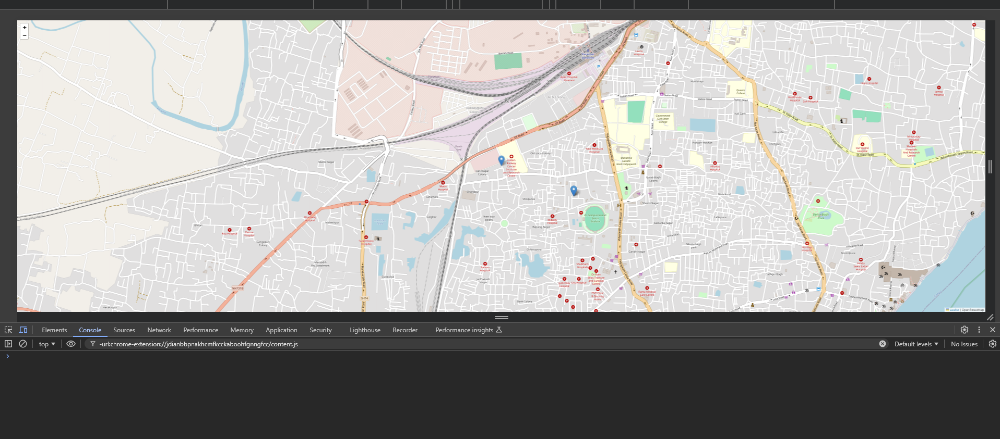

# Real-Time Location Tracker

This project is a backend application designed to track real-time locations of users using web technologies. It leverages WebSockets to provide instant updates and real-time communication between clients and the server.

## Features

- **Real-Time Tracking**: Track user locations instantly using WebSockets.
- **Express Framework**: Handles routing and API endpoints.
- **Socket.IO**: Real-time, bidirectional communication for location updates.
- **EJS Templating**: Renders dynamic content in the frontend.
- **Development with Nodemon**: Auto-reloads the server during development.

## Technologies Used

- [Express](https://expressjs.com/): A minimal and flexible Node.js web application framework for handling routes and middleware.
- [Socket.IO](https://socket.io/): A library for real-time, bidirectional communication between web clients and servers.
- [EJS](https://ejs.co/): A simple templating engine that enables embedding JavaScript into HTML to create dynamic views.
- [Nodemon](https://nodemon.io/): A tool that helps during development by automatically restarting the server when file changes are detected.

  


## Installation

To get started, clone the repository and install the dependencies:

```bash
git clone https://github.com/alavyap/realTime_LocationTracker.git
cd realTime_LocationTracker
npm install
```

## Usage

To start the application in development mode, run the following command:

```bash
npm run dev
```

This will start the server using Nodemon, allowing for hot-reloads when changes are made to the code.

### Start Without Nodemon

```bash
npm start
```

The server will be hosted on `http://localhost:3000`. You can visit this URL in your browser to interact with the location tracking system.

## Folder Structure

- `public/`: Contains static files such as CSS and client-side JavaScript.
- `views/`: Contains EJS files to render dynamic HTML.
- `routes/`: Defines API endpoints and application routes.
- `server.js`: The entry point for the application, where the server and Socket.IO setup is done.

## Real-Time Tracking Implementation

The real-time tracking functionality is powered by Socket.IO. When a user connects to the application, their location data is sent to the server and shared with other connected users in real-time. Socket.IO is used to handle this communication efficiently.

## License

This project is licensed under the MIT License.
